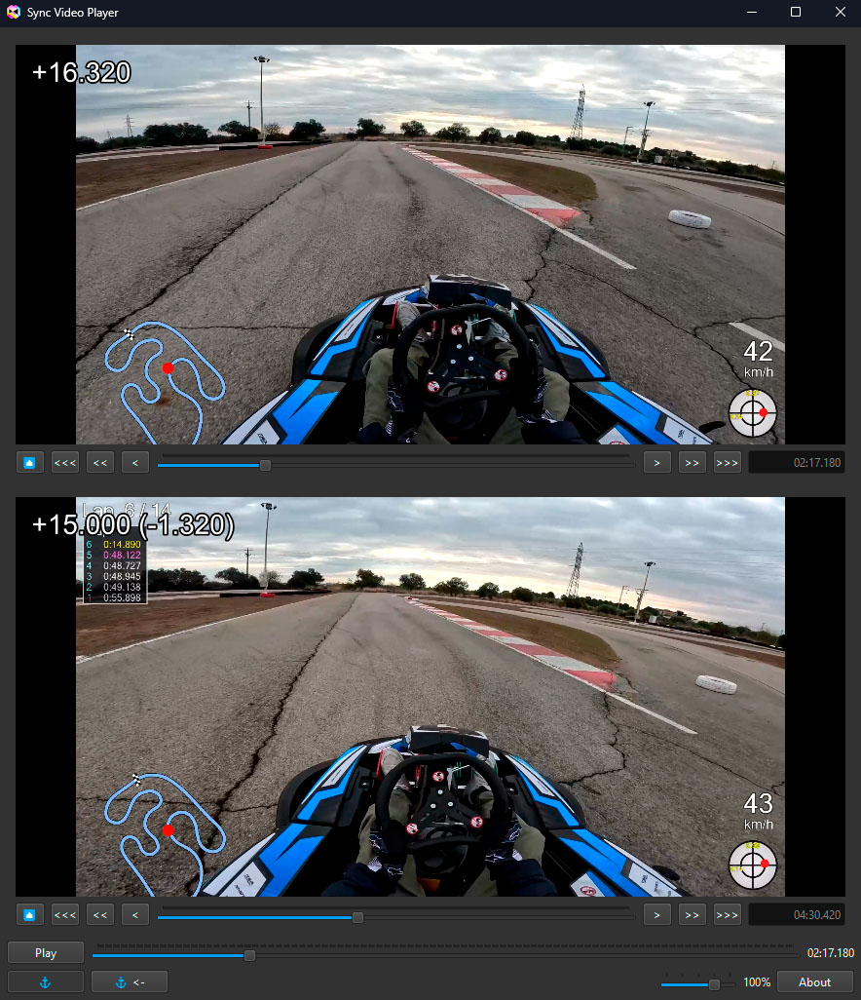

Sync Video Player
=======================================

Video player for playing two videos side-by-side.

* * *

### Features

*   Play and stop two videos synchronously
*   Set anchor points and measure time between events
*   Change playback speed
*   Majority of video formats support thanks to libmpv
*   Cross-platform: Linux, Windows and most likely Mac

### Screenshots



### Usage

#### Basic usage

When the player starts, there are two areas for videos. User may load videos to the areas using 
corresponding buttons or by dragging video files. When both videos are loaded, video controls are made 
available. User may seek the videos separately, to find the same moment of interest in both videos and
then start playback using "Play" button. Additionally, both videos may be synchronously seeked using
the global seek control, which is located in the bottom part of the window.

#### Anchors

User may set up an "anchor" - reference point for both videos by pressing button with anchor icon. When 
an anchor is set up, video playback will indicate time relative to the anchor for each of the videos.
After that, when user performs seek on one of the videos, an offset to the original position of anchor 
will be displayed. This may be used to measure difference between the same events in two
videos, like reaching the same corner in different laps on a racetrack.
There is a special button to return to the anchor point, which also resets all the offsets.
Pressing anchor button again will remove anchor.

#### Playback speed

Playback speed may be set to one of four predefined levels using the slider in the right-bottom part of
the window. User may change speed during playback.

### Download & Installation

Currently, no binary distributions available.

### Building

The project uses pipenv for dependency management, therefore you will need properly working pipenv toolchain.  

#### Linux

The following commands are used to build a snap distribution (should be invoked from the project folder):

```
pipenv shell
PYTHONPATH=. pyinstaller syncvideoplayer.spec
snapcraft
```

### Contributing

If you wish to contribute to the project, please consider using [Github Flow](https://guides.github.com/introduction/flow/). 
Create a branch, add commits, and open a pull request.

### License

This project is licensed under the GPL v3 license.
